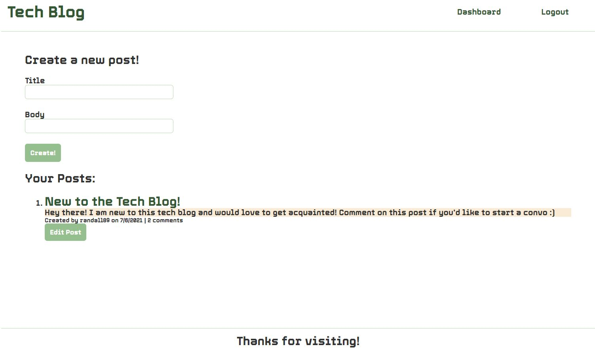

# Tech Blog

## Description
Module 14 weekly challenge assignment. Visit the Tech Blog to see what's being talked about in the tech community! You can browse through the posts or create an account and share your own thoughts!

## Table of Contents
[Installation](link)
 
[Usage](link)
 
[Contributing](link)
 
[Questions](link)

### Installation
I used the following packages to create this website: 
* bcrypt
* connect-session-sequelize
* dotenv
* express
* express-handlebars
* express-session
* mysql2
* sequelize

### Usage
Check out the deployed website at [this link](link) to start blogging! Here's a screenshot of what the blog looks like when you're logged in and creating posts:

### Contributing
If you'd like to contribute to the code, send me an [email](mailto:savvy.bennett8@gmail.com)

### Questions
Got questions? Let me know:
 
[GitHub](https://github.com/savbennett8) [Email](mailto:savvy.bennett8@gmail.com)